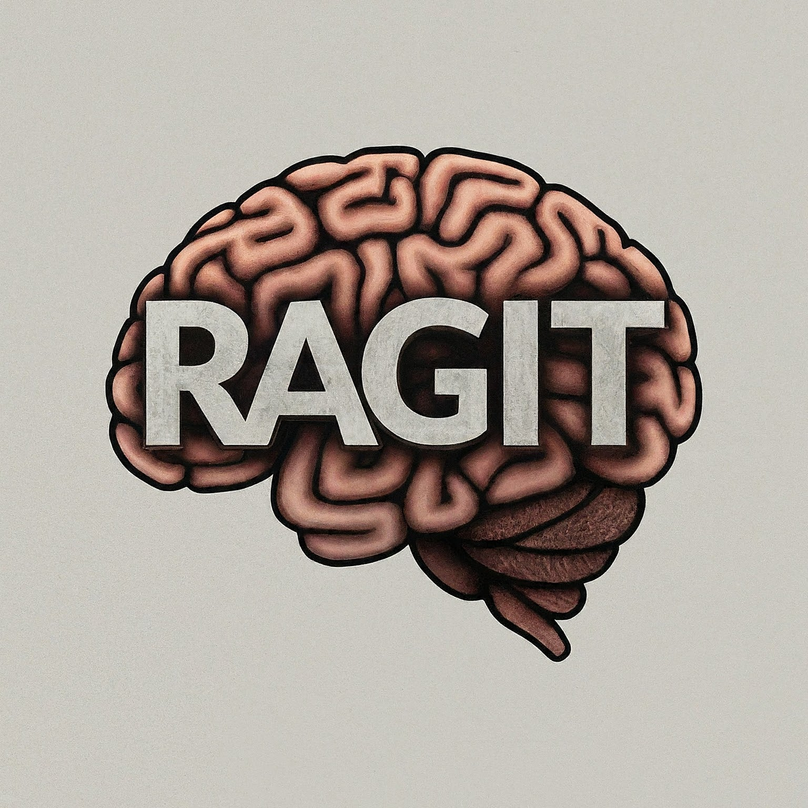

# RAGit: A Framework for Generalized RAG Solutions

Welcome to the official documentation for **RAGit**, an open-source framework
crafted to simplify the development and management of Retrieval-Augmented
Generation (RAG) solutions. RAGit abstracts the complexities of data handling,
model selection, and infrastructure setup, allowing developers to focus on
application logic and customization.

# The Key Principles of RAGit

**Open Source**

RAGit is proudly offered under the GPL license, ensuring it remains open source
for all current and future users.

**Generality**

RAGit is adaptable to any dataset, accommodating a wide array of data types.
This flexibility provides a robust foundation for crafting customized RAG
applications.

**Simplicity**

Our framework prioritizes user-friendliness by abstracting complex data
management processes. With RAGit, you can focus on refining document selection
and optimizing outcomes without delving into intricate implementation details.

**Configurability**

RAGit offers a high degree of customization. Experiment with hyperparameters,
explore various chunk splitting strategies, adjust vector distance algorithms,
and apply prompt engineering to gain full control over your RAG pipeline.

**Comprehensiveness**

Beyond model training and inference, RAGit equips you with tools for efficient
data ingestion, processing, and management, supporting every phase of your
project.

**Vendor Neutrality**

RAGit remains agnostic to specific technologies, allowing for easy integration
and switching between diverse components and services.

By embracing these guiding principles, RAGit accelerates the creation of
effective and robust RAG solutions. Explore our framework to harness its full
potential and drive your projects forward.
